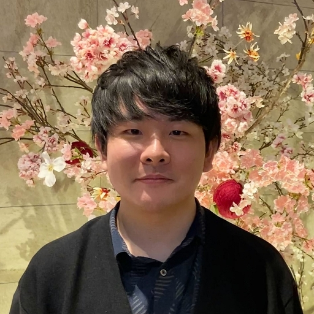

## About Me {#aboutme}

* [ヤフー株式会社](https://about.yahoo.co.jp/) エンジニア  
  Engineer at [Yahoo Japan Corporation](https://about.yahoo.co.jp/)  
* 博士（情報科学）  
  Ph. D. of Information Science

高山 隼矢 (Junya TAKAYAMA)  

<i class="fas fa-envelope-square"></i>takayama.nlp [at] gmail.com  
<i class="fab fa-github-square"></i>[junya-takayama](https://github.com/junya-takayama)  
<i class="fab fa-twitter-square"></i>[tkym1220](https://twitter.com/tkym1220)  
<i class="fas fa-external-link-square-alt"></i>[researchmap: 高山 隼矢](https://researchmap.jp/junya-takayama)

## Research Interests {#research}

* 自然言語処理（Natural Language Processing）
* 雑談対話システム（Chatbot）
    * ニューラル応答生成（Neural Networks for Response Generation）
    * 対話破綻検出（Dialogue Breakdown Detection）
* Internet of Things (IoT)
    * センサデータ（Sensor Data）
* 機械学習（Machine Learning）

## Awards {#awards}
1. 言語処理学会 2022年度**論文賞** -  <u>高山 隼矢</u>, 梶原 智之, 荒瀬 由紀. **対話における間接的応答と直接的応答からなる言い換えコーパスの構築と分析** [[Link](https://www.anlp.jp/award/ronbun.html)]
1. 情報処理学会 第249回自然言語処理研究会 **若手奨励賞** - <u>高山 隼矢</u>, 梶原 智之, 荒瀬 由紀. **間接的な応答と直接的な応答の対からなる対話コーパスの構築** [[Link](https://nl-ipsj.or.jp/young-award/)]
1. **大阪大学大学院情報科学研究科賞（平成30年度）** [[Link](https://www.ist.osaka-u.ac.jp/japanese/introduction/prize.html)]

## Publications {#publications}

#### 学術論文誌 - Journal
1. <u>高山 隼矢</u>, 梶原 智之, 荒瀬 由紀. **対話における間接的応答と直接的応答からなる言い換えコーパスの構築と分析**. 自然言語処理, Vol.29, No.1, March 2022 [[J-STAGE](https://www.jstage.jst.go.jp/article/jnlp/29/1/29_84/_article/-char/ja/)] .
1. <u>Junya Takayama</u>, Eriko Nomoto, Yuki Arase. **Dialogue breakdown detection robust to variations in annotators and dialogue systems**. *Computer Speech & Language*, Vol.54, pp.31-43, March 2019. [[ScienceDirect](https://www.sciencedirect.com/science/article/pii/S0885230818300901)] 

#### 国際会議・ワークショップ（査読あり） - International conferences/Workshops (Refereed)
1. <u>Junya Takayama</u>, Tomoyuki Kajiwara, Yuki Arase: **DIRECT: Direct and Indirect Responses in Conversational Text Corpus**. in *Proceedings of the 2021 Conference on Empirical Methods in Natural Language Processing: Findings*, November 2021. [[ACL Anthology](https://aclanthology.org/2021.findings-emnlp.170/)]
1. Sora Ohashi, <u>Junya Takayama</u>, Tomoyuki Kajiwara, Yuki Arase. **Distinct Label Representations for Few-Shot Text Classification**. in *Proceedings of the Joint Conference of the 59th Annual Meeting of the Association for Computational Linguistics and the 11th International Joint Conference on Natural Language Processing (ACL-IJCNLP 2021)*, August 2021. Acceptance rate: 25.2% (main conference). [[ACL Anthology](https://aclanthology.org/2021.acl-short.105/)]
1. <u>Junya Takayama</u>, Yuki Arase. **Consistent Response Generation with Controlled Specificity** in *Proceedings of the 2020 Conference on Empirical Methods in Natural Language Processing: Findings*, November, 2020. [[ACL anthology](https://www.aclweb.org/anthology/2020.findings-emnlp.396/)]
1. Sora Ohashi, <u>Junya Takayama</u>, Tomoyuki Kajiwara, Chenhui Chu, Yuki Arase. **Text Classification with Negative Supervision**. in *Proceedings of the 58th Annual Meeting of the Association for Computational Linguistics (ACL 2020)*, July 2020. Acceptance rate: 17.6% (short papers). [[ACL Anthology](https://www.aclweb.org/anthology/2020.acl-main.33/)] 
1. <u>Junya Takayama</u>, Yuki Arase. **Relevant and Informative Response Generationusing Pointwise Mutual Information**. in *Proceedings of the NLP for Conversational AI workshop (held at ACL2019)*, August 2019. Acceptance rate: 36.8%. [[ACL Anthology](https://www.aclweb.org/anthology/papers/W/W19/W19-4115/)]
1. Kozo Chikai, <u>Junya Takayama</u>, Yuki Arase. **Responsive and Self-Expressive Dialogue Generation**. in *Proceedings of the NLP for Conversational AI workshop (held at ACL2019)*, August 2019. Acceptance rate: 36.8%. [[ACL Anthology](https://www.aclweb.org/anthology/papers/W/W19/W19-4116/)]
1. Koji Tanaka, <u>Junya Takayama</u>, Yuki Arase. **Dialogue-Act Prediction of Future Response based on Conversation History**. in *Proceedings of ACL 2019, Student Research Workshop*, August 2019. [[ACL Anthology](https://www.aclweb.org/anthology/papers/P/P19/P19-2027/)]

#### 国際ワークショップ（査読なし） - Workshops (Non-refereed)
1. <u>Junya Takayama</u>, Eriko Nomoto, Yuki Arase. **Dialogue Breakdown Detection Considering Annotation Biases**.  in *Proceedings of Dialog System Technology Challenge 6 (DSTC6) Workshop*, December 2017. [[pdf](http://workshop.colips.org/dstc6/papers/track3_paper15_takayama.pdf)] 

#### 国内会議・研究会等 - Domestic
1. **【若手奨励賞】** <u>高山 隼矢</u>, 梶原 智之, 荒瀬 由紀. **間接的な応答と直接的な応答の対からなる対話コーパスの構築**. 情報処理学会第249回自然言語処理研究会, July 2021. 
1. <u>高山 隼矢</u>, 荒瀬 由紀. **Distant Supervision を用いた情報量を制御可能な雑談応答生成**. *言語処理学会第26回年次大会（NLP2020), March 2020. [[pdf](https://www.anlp.jp/proceedings/annual_meeting/2020/pdf_dir/C1-3.pdf)]
1. 田中 昂志, <u>高山 隼矢</u>, 荒瀬 由紀. **対話システムにおける履歴を考慮した応答の対話行為推定**. *第３３回人工知能学会全国大会（JSAI2019）*, June 2019. [[pdf](https://confit.atlas.jp/guide/event-img/jsai2019/1N2-J-9-04/public/pdf?type=in)]
1. <u>高山 隼矢</u>, 荒瀬 由紀. **自己相互情報量を用いた特徴語彙予測に基づく雑談応答生成**. *言語処理学会第25回年次大会（NLP2019）*, March 2019. [[pdf](https://www.anlp.jp/proceedings/annual_meeting/2019/pdf_dir/P3-34.pdf)] [[poster](documents/NLP2019_P3-34_Poster.pdf)] 
1. 大橋 空, <u>高山　隼矢</u>, 梶原　智之, Chenhui Chu, 荒瀬　由紀. **医療ドメインにおける単語分散表現を用いた文単位の言い換え認識**. *NLP若手の会 (YANS) 第13回シンポジウム（YANS2018）*, August 2018.
1. **【学生奨励賞】** 田中 昂志, <u>高山 隼矢</u>, 荒瀬 由紀. **雑談対話システムのための未知語に頑健な興味推定手法**. *情報処理学会第235回自然言語処理研究会*, pp.1-5, May 2018.
1. <u>高山 隼矢</u>, 荒瀬 由紀. **擬似対話コーパス構築のための対話品質推定**. *NLP若手の会 (YANS) 第12回シンポジウム（YANS2017）* , September 2017.
1. <u>高山 隼矢</u>, 三輪 誠, 佐々木 裕. **交通オントロジーに基づく質問応答データセットの構築**. *言語処理学会第23回年次大会（NLP2017）*, pp.691-694, March 2017.

## Experiences {#experiences}

* エンジニア - Engineer:  
[ヤフー株式会社](https://about.yahoo.co.jp/)  
2022-04 ~ 現在
* 研究インターン - Research Intern:  
[rinna株式会社](https://corp.rinna.co.jp/)  
2021-02 ~ 2021-04
* 特任研究員S（非常勤） - Specially Appointed Researcher/Fellow (Part time):  
大阪大学情報科学研究科  
2019-04 ~ 2022-03
* 技術補佐員S（非常勤） - Technical Staff (Temporary Part-Time Staff):  
大阪大学情報科学研究科  
2018-09 ~ 2019-03
* Internship:  
株式会社LIXIL  
2017-08
* Internship:  
株式会社トヨタコミュニケーションシステム（現トヨタシステムズ） 
2016-02 ~ 2016-03

## Other Activities {#others}

#### Organizer
* [人工知能学会全国大会（JSAI）](https://www.ai-gakkai.or.jp/event/national-convention/), 大会委員, 2023 ~ 2024
* [最先端 NLP 勉強会（SNLP）](https://sites.google.com/view/snlp-jp/home), 実行委員（Organizer）, 2018 ~ 2022
* [NLP若手の会（YANS）](https://yans.anlp.jp/), 運営委員（Organizer）, 2021 ~ 2023

#### Teaching Assistant
* **2020-09 ~ 2020-10** [一般社団法人データビリティコンソーシアム](https://cds.or.jp/index.html) 実データで学ぶ人工知能講座（土曜集中コース）, TA
* **2018-09** DLI hands-on training on [NVIDIA GTC Japan](https://www.nvidia.com/ja-jp/gtc/) 2018, TA

#### Talk
* **「対話における間接的応答と直接的応答からなる言い換えコーパスの構築と分析」**. *[言語処理学会第29回年次大会 招待論文セッション](https://www.anlp.jp/proceedings/annual_meeting/2023/#invitedpapers)*, March 2023. 
* **「論文紹介：Prefix-Tuning: Optimizing Continuous Prompts for Generation」**. *[第11回 最先端NLP勉強会（SNLP2021）](https://sites.google.com/view/snlp-jp/home/2021)* September 2021. [[Slide](https://speakerdeck.com/tkym1220/snlp2021-prefix-tuning-optimizing-continuous-prompts-for-generation)]
* **OpenNMTによる雑談対話機能の実装 講師**. *[コトバデザイン](https://cotobadesign.com/)主催 [対話システム勉強会](https://cotobaagent-developers-community.connpass.com/event/188047/)*, October 2020.
* **「ACL2019参加報告」**. *[第10回対話システムシンポジウム（第87回 SIG-SLUD）](https://jsai-slud.github.io/sig-slud/)*, December 2019. [[Slide](https://github.com/jsai-slud/sig-slud/raw/master/material/87th/sympo10_conf_report.pdf)]
* **「論文紹介：Skeleton-to-Response: Dialogue Generation Guided by Retrieval Memory」**. *[第11回 最先端NLP勉強会（SNLP2019）](https://sites.google.com/view/snlp-jp/home/2019)* September 2019. [[Slide](https://docs.google.com/presentation/d/e/2PACX-1vTXYak3cM0fcqLH9BpffoufHNwFop9BcAa_NC8YmSFh8OHr3uZFvDU2IiZA08UzJDypsuQNhFs1guBb/pub?start=false&loop=false&delayms=3000&slide=id.g645a4019e0_0_0)]

## Skills {#skills}

* Python3
    * Jupyter notebook
    * keras, pytorch, sklearn, numpy, scipy, pandas, mpl, Flask, Django, folium etc.
* Scala
* Spark
* Docker
* ~~SPARQL~~

## Education {#education}
* **博士（情報科学）**, 2022-03  
  大阪大学大学院情報科学研究科 マルチメディア工学専攻 博士後期課程 2019-04 ~ 2022-03  
  [ビッグデータ工学講座（鬼塚研）](http://www-bigdata.ist.osaka-u.ac.jp/ja/home/)  
  学位論文：対話システムにおける人間とのコミュニケーションの円滑化に関する研究  
  指導教員：[荒瀬由紀](https://yukiar.github.io/) 准教授
  
* **修士（情報科学）**, 2019-03  
  大阪大学大学院情報科学研究科 マルチメディア工学専攻 博士前期課程 2017-04 ~ 2019-03  
  [ビッグデータ工学講座（鬼塚研）](http://www-bigdata.ist.osaka-u.ac.jp/ja/home/)  
  
* **学士（工学）**, 2017-03  
  豊田工業大学工学部 先端工学基礎学科 2013-04 ~ 2017-03  
  [知能数理研究室（佐々木裕研）](https://coin.toyota-ti.ac.jp/)  
 
* 愛知県立豊田北高校, 2009-04 ~ 2012-03

## Outside Interests {#outside}

#### Hobbies
* 鉄道旅行, ギター, バイク, ゲーム

#### Favorite Musicians
* [**BUMP OF CHICKEN**](http://www.bumpofchicken.com/)
* 米津玄師

#### Favorite Games
* [**The Legend of Zelda series**](https://www.nintendo.co.jp/character/zelda/index.html) : *The most wonderful, fantastic, amazing, marvelous and awesome game in the world...*
* Kingdom Hearts series
* Final Fantasy (VIII, IX, X, X-2, XV)
* Xenoblade 2
* Mario Kart (Super, 64, 8, 8 Deluxe)
